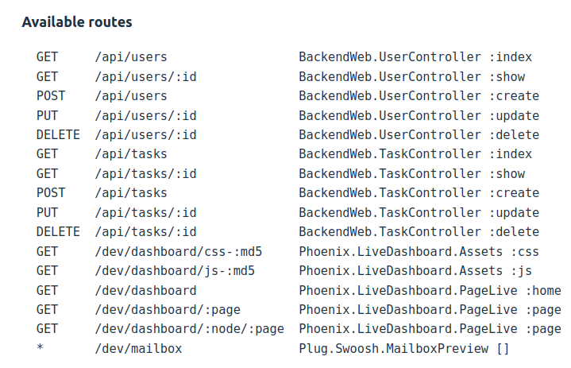

# Time_Manager :

Here is an initiation to Elixir with the framework Phoenix.

## To_begin :

If you want to use your own ```.env``` you have to export values,

And type ```source .env``` where your file is.

Actually in my ```.env``` i got :

- **DATABASE_URL**

But there are default settings too.

### Router

Here is all routes:



you can also check them on your [localhost](localhost:4000) at port 4000